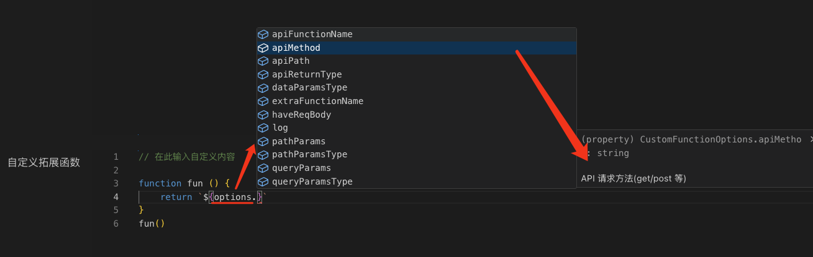

# 高级选项

## 接口模型 - 自定义

可以定制自己想要的接口返回模型和更多的接口拓展功能，结合插件内置暴露的接口配置来自定义接口返回模型。

在 `自定义axios封装` 和 `自定义拓展函数` 的代码编辑器中，定义了插件内置暴露的接口配置 `options`, 可以通过 `options` 配置，自定义接口返回模型和拓展功能。



> 注：在自定义封转时，请使用内置提供的 `apiFunctionName` 和  `extraFunctionName`，请勿自己定义接口方法名。否则无法使用插件的拓展功能。

## 依赖项

配置文件头部需要使用的文件引入依赖项。使用自定义规则，不会自动引入`axios`依赖项，需要手动添加。

> eg:

```ts
import qs from 'qs'
import type { IConfig } from '@galaxy/swrv'
import type { AxiosRequestConfig } from 'axios'
import http from '@/services/http'
import { useMutation, useSWRGet } from '@/services/swrv'
type Expand<T> = T extends infer O ? { [K in keyof O]: O[K] } : never;
```

## 自定义axios封装

可以根据自己的需求，自定义axios请求封装。需要自己实现一个可执行函数，在这个函数中组装好自己想要的数据返回模型的`模版字符串`，并返回。

- 不配置则使用插件内置的返回结果。
- 需要自己定义一个立即执行函数，并返回一个`模版字符串`。

> eg:

```ts
// 在此输入自定义内容
function fun () {
    options.log(`------>查看内置参数: ${JSON.stringify(options)}`)
    const args = []
    const buildParams = () => {
        if (options.pathParams.length) {
            if (options.pathParams.length > 1) {
                args.push(`pathParams: Expand<${options.pathParamsType}>`);
            } else {
                // 如果只有一个路径参数，直接传递其值
                args.push(
                    `${options.pathParams[0].name}: ${options.buildParameters(options.pathParams[0])}`
                );
            }
        }
        if (options.queryParams.length) {
            args.push(`params: Expand<${options.queryParamsType}>`);
        }
        if (!["get", "delete", "head", "options"].includes(options.apiMethod || "get") && options.haveReqBody) {
            args.push(`data: Expand<${options.dataParamsType}>`);
        }
    }
    buildParams()
    const url = options.queryParams.length ? `\`${options.apiPath}${options.queryParams.length ? "?${qs.stringify(params)}" : ""}\`` : `'${options.apiPath}'`;
    const bodyParams = ["get", "delete", "head", "options"].includes(options.apiMethod) ? '' : (options.haveReqBody ? 'data, ' : '{}, ')

    return `export const ${options.apiFunctionName} = async (${args.join(", ")}): Promise<Expand<${options.apiFunctionName}Res>> => {${'\n'}    return http.${options.apiMethod}(${url}, ${bodyParams}axiosConfig);${'\n'}}`
}
fun()
```

- 保存之后，在右侧选中接口或者文件夹生成接口文件。

> eg: 以下是生成后的接口方法（OpenAI 项目下的`微调`模块为例）。

```ts
/* eslint-disable @typescript-eslint/no-unused-vars */
// @ts-nocheck: 忽略类型错误 系统工具生成
import http from '@/services/http'
import qs from 'qs'
import type {
  getFineTuningJobsFineTuningJobIdRes,
  getJobsFineTuningJobIdEventsQuery,
  getJobsFineTuningJobIdEventsRes,
  getV1FineTuningJobsQuery,
  getV1FineTuningJobsRes,
  postJobsFineTuningJobIdCancelRes,
  postV1FineTuningJobsBody,
  postV1FineTuningJobsRes,
} from './interface'
type Expand<T> = T extends infer O ? { [K in keyof O]: O[K] } : never

/**
 * @description /创建微调作业
 * @url POST https://api.openai.com/v1/fine_tuning/jobs
 * @host https://app.apifox.com/link/project/5464284/apis/api-233846094
 */
export const postV1FineTuningJobs = async (
  data: Expand<postV1FineTuningJobsBody>,
): Promise<Expand<postV1FineTuningJobsRes>> => {
  return http.post(
    'https://api.openai.com/v1/fine_tuning/jobs',
    data,
    axiosConfig,
  )
}

/**
 * @description /列出微调作业
 * @url GET https://api.openai.com/v1/fine_tuning/jobs
 * @host https://app.apifox.com/link/project/5464284/apis/api-233846095
 */
export const getV1FineTuningJobs = async (
  params: Expand<getV1FineTuningJobsQuery>,
): Promise<Expand<getV1FineTuningJobsRes>> => {
  return http.get(
    `https://api.openai.com/v1/fine_tuning/jobs?${qs.stringify(params)}`,
    axiosConfig,
  )
}

/**
 * @description /检索微调作业
 * @url GET https://api.openai.com/v1/fine_tuning/jobs/{fine_tuning_job_id}
 * @host https://app.apifox.com/link/project/5464284/apis/api-233846096
 */
export const getFineTuningJobsFineTuningJobId = async (
  fine_tuning_job_id: string,
): Promise<Expand<getFineTuningJobsFineTuningJobIdRes>> => {
  return http.get(
    'https://api.openai.com/v1/fine_tuning/jobs/${fine_tuning_job_id}',
    axiosConfig,
  )
}

/**
 * @description /取消微调
 * @url POST https://api.openai.com/v1/fine_tuning/jobs/{fine_tuning_job_id}/cancel
 * @host https://app.apifox.com/link/project/5464284/apis/api-233846097
 */
export const postJobsFineTuningJobIdCancel = async (
  fine_tuning_job_id: string,
): Promise<Expand<postJobsFineTuningJobIdCancelRes>> => {
  return http.post(
    'https://api.openai.com/v1/fine_tuning/jobs/${fine_tuning_job_id}/cancel',
    {},
    axiosConfig,
  )
}

/**
 * @description /列出微调事件
 * @url GET https://api.openai.com/v1/fine_tuning/jobs/{fine_tuning_job_id}/events
 * @host https://app.apifox.com/link/project/5464284/apis/api-233846098
 */
export const getJobsFineTuningJobIdEvents = async (
  fine_tuning_job_id: string,
  params: Expand<getJobsFineTuningJobIdEventsQuery>,
): Promise<Expand<getJobsFineTuningJobIdEventsRes>> => {
  return http.get(
    `https://api.openai.com/v1/fine_tuning/jobs/${fine_tuning_job_id}/events?${qs.stringify(params)}`,
    axiosConfig,
  )
}
```

## 自定义拓展函数

除了生成axios请求方法外，还可以自定义拓展函数，赋予普通接口请求方法更多的能力。比如使用`swrv`、`vueuse的useAxios`对接口请求处理得到更丰富的能力。

封装方法和提供的内置参数如 `自定义axios` 一致，都是需要自己实现一个立即执行函数，并返回一个`模版字符串`。

> eg: 以下是我们目前基于`swrv`对接口请求方法进行拓展的示例。

```ts
const fun = () => {
    const buildParams = () => {
      const args = []
      if (options.pathParams.length) {
        if (options.pathParams.length > 1) {
          args.push(`pathParams: Expand<${options.pathParamsType} | Ref<${options.pathParamsType}>>`);
        } else {
          args.push(`${options.pathParams[0].name}: string`);
        }
      }
      if (options.queryParams.length) {
        args.push(`params: Expand<${options.queryParamsType} | Ref<${options.queryParamsType}>>`);
      }
      if (!['get', 'delete', 'head', 'options'].includes(options.apiMethod) && options.haveReqBody) {
        args.push(`data: Expand<${options.dataParamsType} | Ref<${options.dataParamsType}>>`);
      }
      const config = options.apiMethod === 'get' ? 'swrvConfig: IConfig = {}' : `axiosConfig?: AxiosRequestConfig`
      args.push(config)
      return args.join(', ')
    }
    if (options.apiMethod === 'get') {
      const computedParams = options.queryParams.length ? '\n   const computedParams = computed(() => qs.stringify(unref(params)))' : ''
      const allPath = options.queryParams.length ? `() => computedParams.value && \`${options.apiPath}?\${computedParams.value}\`` : `\`${options.apiPath}\``
      return `${'\n'}export const ${options.extraFunctionName} = (${buildParams()}) => {${computedParams}${'\n'}    return useSWRGet<Expand<${options.apiReturnType}>>(${allPath}, swrvConfig)${'\n'}}`
    } else {
      return `${'\n'}export const ${options.extraFunctionName} = (axiosConfig?: AxiosRequestConfig) => {${'\n'}   return useMutation<Expand<${options.apiReturnType}>, Expand<${options.dataParamsType}>>(${options.apiFunctionName}, axiosConfig)${'\n'}}`
    }
  }
fun()
```

> 依然是以 `OpenAI` 项目下的`微调`模块为例，生成后的拓展方法如下。

```ts
/* eslint-disable @typescript-eslint/no-unused-vars */
// @ts-nocheck: 忽略类型错误 系统工具生成
import http from '@/services/http'
import { useMutation, useSWRGet } from '@/services/swrv'
import type { IConfig } from '@galaxy/swrv'
import type { AxiosRequestConfig } from 'axios'
import qs from 'qs'
import type {
  getFineTuningJobsFineTuningJobIdRes,
  getJobsFineTuningJobIdEventsQuery,
  getJobsFineTuningJobIdEventsRes,
  getV1FineTuningJobsQuery,
  getV1FineTuningJobsRes,
  postJobsFineTuningJobIdCancelRes,
  postV1FineTuningJobsBody,
  postV1FineTuningJobsRes,
} from './interface'
type Expand<T> = T extends infer O ? { [K in keyof O]: O[K] } : never

/**
 * @description /创建微调作业
 * @url POST https://api.openai.com/v1/fine_tuning/jobs
 * @host https://app.apifox.com/link/project/5464284/apis/api-233846094
 */
export const postV1FineTuningJobs = async (
  data: Expand<postV1FineTuningJobsBody>,
): Promise<Expand<postV1FineTuningJobsRes>> => {
  return http.post(
    'https://api.openai.com/v1/fine_tuning/jobs',
    data,
    axiosConfig,
  )
}

/**
 * 自定义函数：usepostV1FineTuningJobs
 * @description /创建微调作业
 * @url POST https://api.openai.com/v1/fine_tuning/jobs
 * @host https://app.apifox.com/link/project/5464284/apis/api-233846094
 */

export const usePostV1FineTuningJobs = (axiosConfig?: AxiosRequestConfig) => {
  return useMutation<
    Expand<postV1FineTuningJobsRes>,
    Expand<postV1FineTuningJobsBody>
  >(postV1FineTuningJobs, axiosConfig)
}

/**
 * @description /列出微调作业
 * @url GET https://api.openai.com/v1/fine_tuning/jobs
 * @host https://app.apifox.com/link/project/5464284/apis/api-233846095
 */
export const getV1FineTuningJobs = async (
  params: Expand<getV1FineTuningJobsQuery>,
): Promise<Expand<getV1FineTuningJobsRes>> => {
  return http.get(
    `https://api.openai.com/v1/fine_tuning/jobs?${qs.stringify(params)}`,
    axiosConfig,
  )
}

/**
 * 自定义函数：usegetV1FineTuningJobs
 * @description /列出微调作业
 * @url GET https://api.openai.com/v1/fine_tuning/jobs
 * @host https://app.apifox.com/link/project/5464284/apis/api-233846095
 */

export const useGetV1FineTuningJobs = (
  params: Expand<getV1FineTuningJobsQuery | Ref<getV1FineTuningJobsQuery>>,
  swrvConfig: IConfig = {},
) => {
  const computedParams = computed(() => qs.stringify(unref(params)))
  return useSWRGet<Expand<getV1FineTuningJobsRes>>(
    () =>
      computedParams.value &&
      `https://api.openai.com/v1/fine_tuning/jobs?${computedParams.value}`,
    swrvConfig,
  )
}

/**
 * @description /检索微调作业
 * @url GET https://api.openai.com/v1/fine_tuning/jobs/{fine_tuning_job_id}
 * @host https://app.apifox.com/link/project/5464284/apis/api-233846096
 */
export const getFineTuningJobsFineTuningJobId = async (
  fine_tuning_job_id: string,
): Promise<Expand<getFineTuningJobsFineTuningJobIdRes>> => {
  return http.get(
    'https://api.openai.com/v1/fine_tuning/jobs/${fine_tuning_job_id}',
    axiosConfig,
  )
}

/**
 * 自定义函数：usegetFineTuningJobsFineTuningJobId
 * @description /检索微调作业
 * @url GET https://api.openai.com/v1/fine_tuning/jobs/{fine_tuning_job_id}
 * @host https://app.apifox.com/link/project/5464284/apis/api-233846096
 */

export const useGetFineTuningJobsFineTuningJobId = (
  fine_tuning_job_id: string,
  swrvConfig: IConfig = {},
) => {
  return useSWRGet<Expand<getFineTuningJobsFineTuningJobIdRes>>(
    `https://api.openai.com/v1/fine_tuning/jobs/${fine_tuning_job_id}`,
    swrvConfig,
  )
}

/**
 * @description /取消微调
 * @url POST https://api.openai.com/v1/fine_tuning/jobs/{fine_tuning_job_id}/cancel
 * @host https://app.apifox.com/link/project/5464284/apis/api-233846097
 */
export const postJobsFineTuningJobIdCancel = async (
  fine_tuning_job_id: string,
): Promise<Expand<postJobsFineTuningJobIdCancelRes>> => {
  return http.post(
    'https://api.openai.com/v1/fine_tuning/jobs/${fine_tuning_job_id}/cancel',
    {},
    axiosConfig,
  )
}

/**
 * 自定义函数：usepostJobsFineTuningJobIdCancel
 * @description /取消微调
 * @url POST https://api.openai.com/v1/fine_tuning/jobs/{fine_tuning_job_id}/cancel
 * @host https://app.apifox.com/link/project/5464284/apis/api-233846097
 */

export const usePostJobsFineTuningJobIdCancel = (
  axiosConfig?: AxiosRequestConfig,
) => {
  return useMutation<
    Expand<postJobsFineTuningJobIdCancelRes>,
    Expand<postJobsFineTuningJobIdCancelBody>
  >(postJobsFineTuningJobIdCancel, axiosConfig)
}

/**
 * @description /列出微调事件
 * @url GET https://api.openai.com/v1/fine_tuning/jobs/{fine_tuning_job_id}/events
 * @host https://app.apifox.com/link/project/5464284/apis/api-233846098
 */
export const getJobsFineTuningJobIdEvents = async (
  fine_tuning_job_id: string,
  params: Expand<getJobsFineTuningJobIdEventsQuery>,
): Promise<Expand<getJobsFineTuningJobIdEventsRes>> => {
  return http.get(
    `https://api.openai.com/v1/fine_tuning/jobs/${fine_tuning_job_id}/events?${qs.stringify(params)}`,
    axiosConfig,
  )
}

/**
 * 自定义函数：usegetJobsFineTuningJobIdEvents
 * @description /列出微调事件
 * @url GET https://api.openai.com/v1/fine_tuning/jobs/{fine_tuning_job_id}/events
 * @host https://app.apifox.com/link/project/5464284/apis/api-233846098
 */

export const useGetJobsFineTuningJobIdEvents = (
  fine_tuning_job_id: string,
  params: Expand<
    getJobsFineTuningJobIdEventsQuery | Ref<getJobsFineTuningJobIdEventsQuery>
  >,
  swrvConfig: IConfig = {},
) => {
  const computedParams = computed(() => qs.stringify(unref(params)))
  return useSWRGet<Expand<getJobsFineTuningJobIdEventsRes>>(
    () =>
      computedParams.value &&
      `https://api.openai.com/v1/fine_tuning/jobs/${fine_tuning_job_id}/events?${computedParams.value}`,
    swrvConfig,
  )
}
```

- 从上面可以看到，在生成一个通用的axios请求方法时，会同时生成一个对应的`use`的方法，项目中使用时，根据自己的需要选择使用响应式的`use`方法还是普通的`axios`请求方法.

## 注意事项

- 自定义配置时，需要注意返回的模板字符串是否正确处理
- 可以在本地先写一份通用的方法，然后再来自定义配置，这样会减少生成错误
- 在自定义配置过程中可以使用内置的`options.log`方法来打印一些信息，会在编辑器中的输出窗口查看，方便调试
