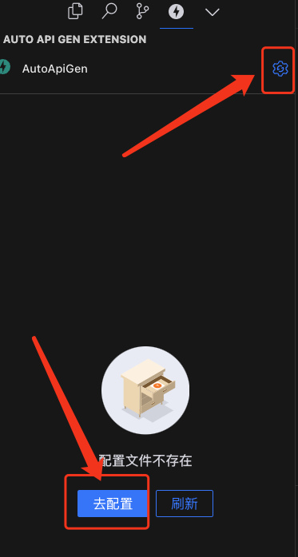
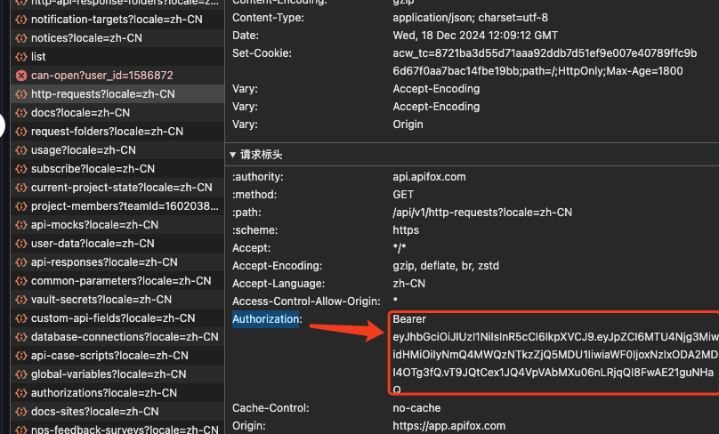
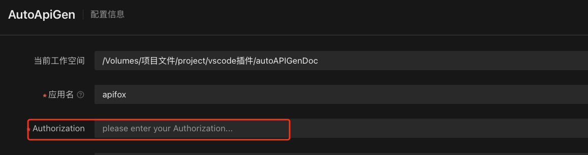
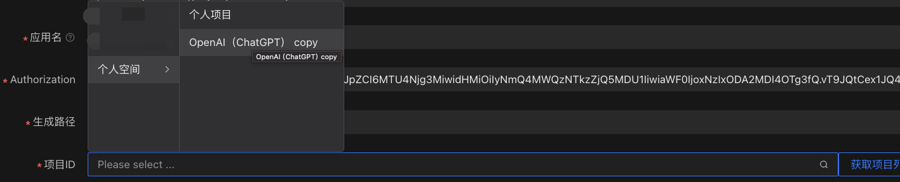
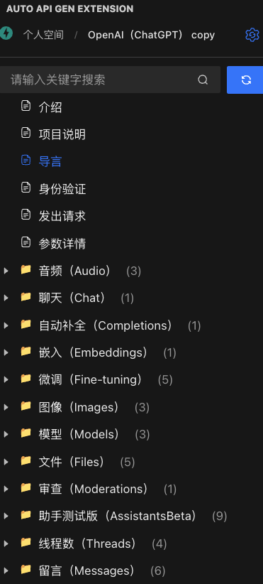
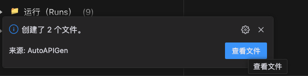
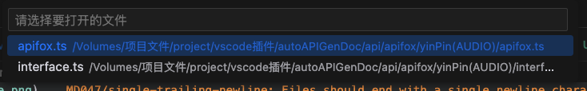

<!--
 * @FilePath: /autoAPIGenDoc/docs/guide/quickstart.md
 * @Description: 
-->
# 快速开始

- 团队API文档在[apifox](https://app.apifox.com)上编写
- 在vscode中打开一个项目
- 安装autoAPIGen插件
- 打开autoAPIGen插件
- 点击右上角的按钮或者`去配置`按钮

- 在浏览器中打开[apifox](https://app.apifox.com) 并登录，F12打开控制台的network面板，点击任意一个接口查看请求头，复制`Authorization`的值

- 粘贴到autoAPIGen插件的`Authorization`配置中

- 点击`获取项目列表`, 选择需要使用的项目

- 选择自己所需的项目配置（具体配置说明请看配置说明）

- 点击`保存`按钮，在左侧的`接口列表`中即可看到自己项目中的所有接口

- 选中要生成的目录，点击`生成接口`（生成目录下的所有接口）,或者单个的接口，点击`生成接口`（生成此接口）

  
  

- 生成后在消息通知中可以看到生成结果，点击`查看`，可以选择需要查看的文件

  
