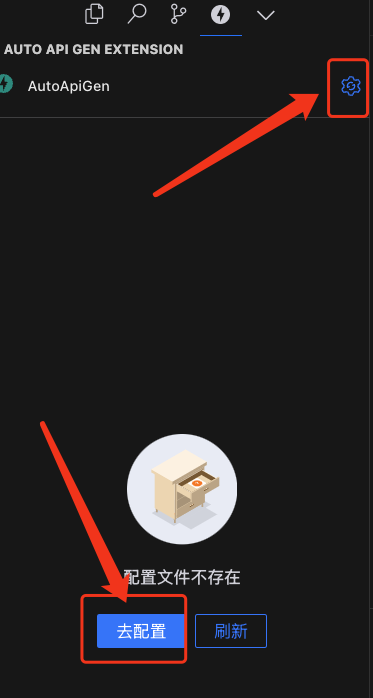
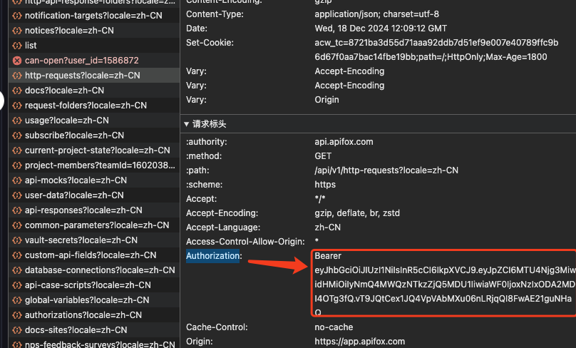
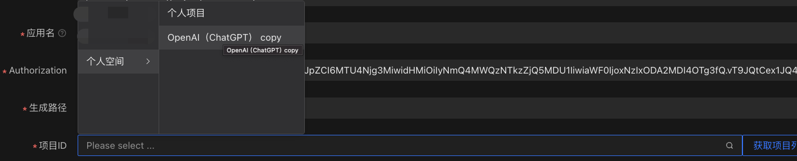
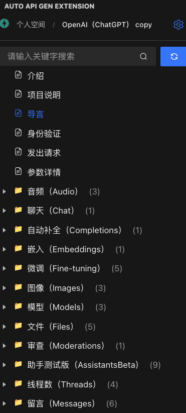
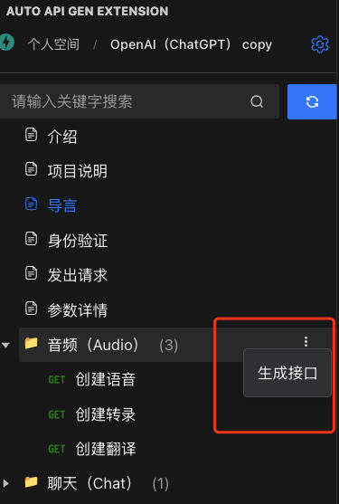
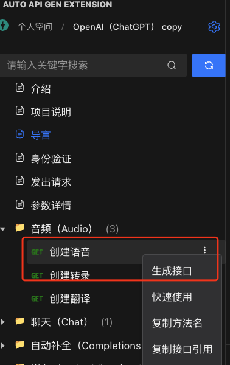

# 快速开始

这份指南按照 **真实项目接入顺序** 来写：先把插件跑起来，再验证生成目录，最后决定是否接入 AI / CLI。

## 第 1 步：安装并打开插件

1. 在 VS Code 扩展市场搜索 **AutoAPIGen**
2. 安装后打开你的项目根目录
3. 打开 AutoAPIGen 侧边栏
4. 如果没有配置，会看到“去配置”入口



## 第 2 步：准备认证信息

当前 Apifox 推荐使用 **Cookie**，旧流程仍兼容 `Authorization`。

| 方式 | 推荐程度 | 说明 |
| --- | --- | --- |
| `Cookie` | 推荐 | 适合当前 Apifox 登录态 |
| `Authorization` | 兼容 | 用于旧项目或仍保留 Token 流程的场景 |

### 获取 Cookie

1. 打开 [Apifox](https://app.apifox.com) 并登录
2. 按 `F12` 打开开发者工具
3. 在 `Network` 里点开任意请求
4. 复制请求头中的完整 `Cookie`



## 第 3 步：完成基础配置

最小可用配置通常包括：

```json
{
  "appName": "apifox",
  "Cookie": "你的 Cookie",
  "path": "/src/services",
  "projectId": [3903128],
  "model": "custom",
  "useProjectName": true,
  "useProjectId": true
}
```

重点说明：

- `appName` 会成为生成目录的第一层
- `path` 推荐写你希望存放生成结果的业务目录
- `projectId` 可以配置多个，实际使用最后一个当前选中值
- `useProjectName: true` 时会自动插入 PascalCase 项目名目录
- `useProjectId: true` 时会在请求配置里透传当前项目 ID

> `path` 字段历史上很多项目会写成 `"/src/services"`。当前版本插件和 CLI 都会按**项目根目录**拼接，兼容这种写法。

## 第 4 步：选择项目并保存

1. 在配置页填入 `Cookie` 或 `Authorization`
2. 点击“获取项目列表”
3. 选择当前要生成的项目
4. 保存配置



保存后，项目根目录会出现：

```text
.vscode/autoApiGen.json
```

这也是后续 `aag` CLI 会读取的同一份配置。

## 第 5 步：在插件里生成第一个接口

你可以从两个入口开始：

| 入口 | 适合场景 |
| --- | --- |
| 对单接口执行“生成接口” | 先验证生成结果是否符合团队风格 |
| 对文件夹执行“生成接口” | 一次性生成一个业务分组 |






## 第 6 步：确认输出是否符合预期

默认输出结构：

```text
<config.path>/<appName>/[<projectName(PascalCase)>/]<groupPath>/
├── apifox.ts
└── interface.ts
```

### 真实项目示例 1：`h5-nextjs`

```text
src/services/apifox/ChaoJiAPP/dianPu/
├── apifox.ts
└── interface.ts
```

### 真实项目示例 2：`admin-refactor`

```text
apps/copilot/src/services/apifox/AIBFFJieKou/huiHuaGuanLi/
├── apifox.ts
└── interface.ts
```

如果你的生成结果也落在类似结构，说明路径规则已经跑通。

## 第 7 步：决定是否接入 AI / CLI

插件跑通之后，再决定是否启用终端工作流：

```bash
aag init
aag groups
aag query 店铺 --json
aag generate 324170228
```

如果你准备让 AI 帮你调用接口，下一步直接看：

- [AI / CLI 指南](/guide/ai-support)

## 常见检查项

| 现象 | 优先检查 |
| --- | --- |
| 获取不到项目列表 | `Cookie` / `Authorization` 是否过期 |
| 生成目录不对 | `path`、`appName`、`useProjectName` 是否符合预期 |
| 请求函数没有带 `projectId` | `useProjectId` 是否开启，自定义模板是否使用该字段 |
| 生成类型不符合团队封装 | 是否正在使用 `custom` 模型，`head` / `customReturn` / `customExtraFunction` 是否配置正确 |
