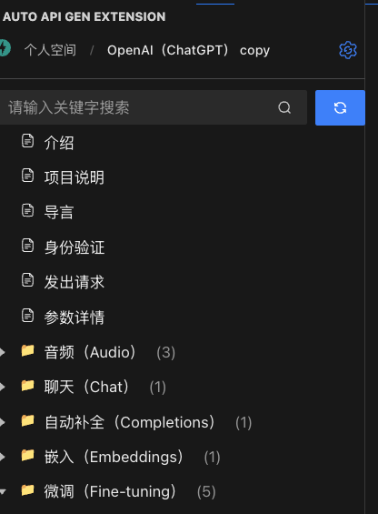
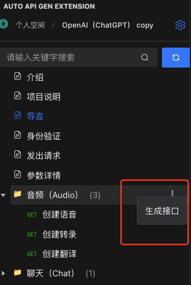
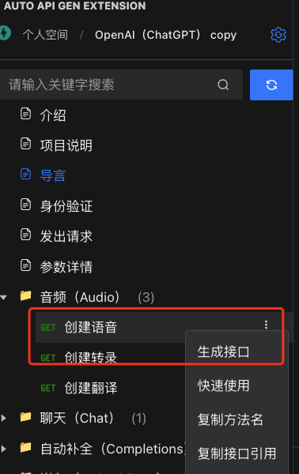

# 基础用法

## 快速搜索与刷新接口列表

- 在 **搜索框** 中输入接口名称或接口路径中的关键词，快速过滤需要查看的接口，便于定位。
- 点击 **刷新按钮**，重新调用接口以刷新接口列表。当接口文档更新时，务必点击刷新同步最新的接口信息。

---

## 生成接口代码

- **文件夹上的生成接口**：
  - 将生成该文件夹下所有接口及其对应的 TypeScript 类型定义。
  - 若目录不存在，则自动创建；若目录已存在：
    1. 备份文件；
    2. 生成接口文件；
    3. 生成成功后删除备份文件。

- **接口上的生成接口**：
  - 仅生成该接口及其对应的 TypeScript 类型定义。
  - 若接口不存在，则直接生成；
  - 若接口已存在，则执行以下操作：
    1. 删除原接口方法；
    2. 新增该接口。

  
  

---

## 快速使用接口

- 在接口列表中找到目标接口，点击 **快速使用** 按钮，即可将该接口的引用代码插入到当前激活的编辑窗口中。
- 快速实现接口引用，无需手动编写。

<video controls width="600">
  <source src="./img/录屏2024-12-19 16.37.05.mov" type="video/mp4">
  您的浏览器不支持视频播放，请升级到支持 HTML5 的浏览器。
</video>

---

## 功能扩展

### 复制方法名

- 点击 **复制方法名** 按钮，即可快速将接口方法名复制到剪切板。
- 便于在项目中粘贴使用，无需手动查找。

### 复制接口引用

- 此功能与 **快速使用** 类似，但不会直接插入代码。
- 点击 **复制接口引用**，接口的引用代码将复制到剪切板，开发者可根据需要在项目中手动粘贴使用。

---

## 查看接口方法

- 在接口列表中，点击 **查看接口方法** 按钮，自动打开对应接口的代码文件。
- 自动定位到该方法的位置，便于快速查看接口的详细配置信息及实现逻辑。

---

通过以上功能，**AutoAPIGen** 帮助开发者更高效地管理和使用接口代码，大幅提升开发体验。
