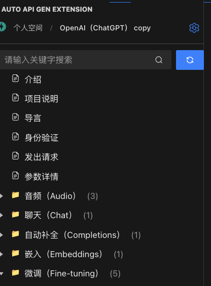

# 基础用法

这页重点回答三个问题：

1. 插件里怎么高效生成
2. 生成后的文件结构和更新行为是什么
3. 在真实项目里应该如何组织和引用这些文件

## 1. 搜索、浏览与刷新

- 在左侧搜索框输入接口名称、路径关键词，可快速过滤接口树
- 当 Apifox 文档更新后，点击刷新重新拉取接口树
- 接口详情页适合在生成前确认参数、响应结构和示例



## 2. 两种生成方式

### 单接口生成

适合：

- 先验证生成风格
- 只补某一个新接口
- 避免一次生成过多分组

### 文件夹生成

适合：

- 一个业务分组整体落地
- 首次接入时补齐整个目录
- 与 AI 配合时按分组生成一批接口

## 3. 生成后的文件结构

AutoAPIGen 会生成两个核心文件：

| 文件 | 作用 |
| --- | --- |
| `apifox.ts` | 请求函数、可选的 Hook / 辅助函数 |
| `interface.ts` | Query / Body / Response 的 TypeScript 类型定义 |

统一目录结构：

```text
<config.path>/<appName>/[<projectName(PascalCase)>/]<groupPath>/
├── apifox.ts
└── interface.ts
```

## 4. 更新机制

当目标目录已存在时，插件不是简单粗暴覆盖，而是按接口粒度更新：

| 场景 | 行为 |
| --- | --- |
| 新接口首次生成 | 直接创建目录与文件 |
| 已有接口重新生成 | 删除旧方法与旧类型，再写入最新结果 |
| 同目录下其他接口存在 | 保留未受影响的方法和类型 |

这也是为什么生成目录建议按业务分组拆开，而不是把所有接口都堆在同一个文件夹里。

## 5. 真实项目中的推荐组织方式

### Next.js 单仓：`h5-nextjs`

推荐目录：

```text
src/services/apifox/ChaoJiAPP/dianPu/
```

特点：

- 业务代码里直接从 `@/services/...` 引入
- 自定义 `http` 封装
- 生成 `useQuery` / `useMutation` / `queryOptions`

真实生成代码示意：

```ts
import { useGetSuperAppShopList } from '@/services/apifox/ChaoJiAPP/dianPu/apifox'

const { data } = useGetSuperAppShopList(
  { page: 1, page_size: 10 },
  {},
  {},
)
```

### Monorepo：`admin-refactor`

推荐目录：

```text
apps/copilot/src/services/apifox/AIBFFJieKou/huiHuaGuanLi/
```

特点：

- 生成目录直接落在具体子应用里
- `path` 可写成 `/apps/copilot/src/services`
- 适合多个 app 分别生成自己的服务层

## 6. 快速使用接口

插件中除了“生成接口”，还可以直接：

- 复制方法名
- 复制接口引用
- 快速将 import / 调用片段插入当前编辑器
- 从接口详情页打开已经生成的实现文件

<video controls width="600">
  <source src="./img/录屏2024-12-19 16.37.05.mov" type="video/mp4">
  您的浏览器不支持视频播放，请升级到支持 HTML5 的浏览器。
</video>

## 7. 什么时候切到 CLI 更合适

下面这些场景，建议直接用 `aag`：

| 场景 | 推荐命令 |
| --- | --- |
| 先看全部分组结构 | `aag groups` |
| 让 AI 读取结构化摘要 | `aag query 关键词 --json` |
| 直接在终端交互浏览 | `aag ui` |
| 批量生成一组接口 ID | `aag generate <id1> <id2> ...` |

## 8. 几个很实用的经验

1. **先按分组建目录，再频繁增量更新**，比把所有接口堆在一个目录里更好维护。
2. **自定义模板里要显式使用 `useProjectId`**，否则即使配置开启，也不会反映到最终请求代码里。
3. **AI 使用时优先读本地文件**，本地已有 `apifox.ts` / `interface.ts` 就不必重复查 Apifox。
4. **当生成结果与项目实际约定不一致时，先检查 `head`、`customReturn`、`customExtraFunction`**，不要先怀疑类型解析。
